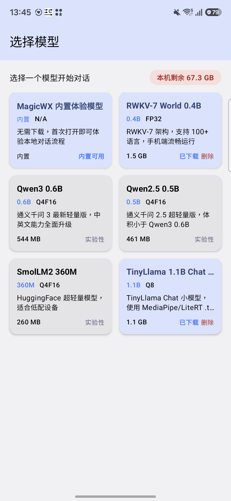
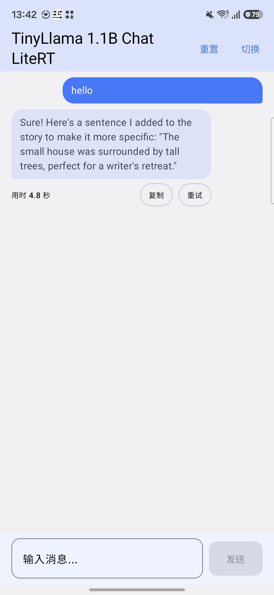

# MagicWX

MagicWX is an Android 17 local LLM inference prototype built with Kotlin, Jetpack Compose, Material3, and ONNX Runtime Android. It focuses on offline AI model selection, verified local model package checks, and a simple on-device chat flow.

Keywords: Android local LLM, Android 17 AI app, Jetpack Compose AI chat, ONNX Runtime Android, offline LLM prototype, Qwen Android, SmolLM2 Android, local AI inference, 端侧大模型, 安卓离线 AI, 本地大模型推理.

## Current Status

- Android app prototype: available.
- Latest prototype release: `v1.1.4`.
- Android target: API 37 / Android 17.
- Verified production-ready models: none yet.
- Verified first-run path: built-in MagicWX experience model, no external download required.
- Runtime adapters in code: `BUILTIN_TEXT` and `ONNX_TEXT_GENERATION` are implemented; ASR, VAD, TTS, Vision, VLM, LiteRT, MediaPipe, Piper, sherpa-onnx, NCNN, and MNN remain gated candidates.
- ONNX path in code: local text generation prototype with verified Transformer downloads and adapter-based loading.
- Background downloads: user-started foreground service with persistent progress notification and model-card progress state.
- Transformer entries: experimental candidates that require model-specific tokenizer, input/output, dry-run, and golden-output validation before public support claims.
- Multimodal scope: LLM, ASR, VAD, TTS, image understanding, VLM, and image generation candidates are tracked separately because each modality needs its own runtime pipeline.

The repository intentionally distinguishes registered model candidates from verified GA support. Do not describe a model as supported until it has a complete package manifest, required assets, successful load, fixed-input dry-run, and device verification evidence.

## App Runtime Screenshot




## Project Structure

```text
com.qihao.open.rwkv/
├── App.kt                    # Application entry
├── MainActivity.kt           # Jetpack Compose UI states
├── model/
│   ├── ITokenizer.kt         # Tokenizer interface
│   ├── RWKVTokenizer.kt      # RWKV vocabulary tokenizer
│   ├── HFTokenizer.kt        # Experimental tokenizer.json reader
│   ├── BuiltinExperienceModel.kt # Built-in no-download demo engine
│   ├── TextGenerationEngine.kt # Shared generation interface
│   ├── RWKVModel.kt          # ONNX Runtime inference wrapper
│   ├── ModelInfo.kt          # Registered model metadata
│   ├── ModelDownloader.kt    # Download and local package checks
│   └── adapter/
│       └── ModelRuntimeAdapter.kt # Runtime adapter dispatch and load gates
├── service/
│   ├── ModelDownloadService.kt # Foreground model download service
│   └── ModelDownloadEvents.kt  # In-process download progress events
├── viewmodel/
│   └── MainViewModel.kt      # MVVM state and user actions
└── ui/theme/
    └── Theme.kt              # Material3 theme
```

Human-facing product, design, and development documents live under `doc/`. AI-facing change plans live under `openspec/`.

## Registered Models

The app currently exposes only models that passed device validation. The built-in model is a deterministic local experience engine, not a bundled large model weight. External models stay in the app only after they pass download, tokenizer, ONNX load, basic chat, and device-log checks.

| Model | Architecture | Download status | Runtime status |
|---|---|---|---|
| MagicWX built-in experience | Built-in | Bundled in code | Verified on device for first-run chat |
| RWKV-7 World 0.4B | RWKV | Verified full download on Samsung test device via HF mirror fallback | Verified ONNX load and `hello` chat response |
| Qwen3 0.6B | Transformer | Verified full download on Samsung test device | Verified `hello` chat response |
| Qwen2.5 0.5B | Transformer | Verified full download on Samsung test device | Verified `hello` chat response |
| SmolLM2 360M | Transformer | Verified full download on Samsung test device | Verified `hello` chat response |

DeepSeek-R1, Gemma 3, Phi-3, Llama 3.2, TinyLlama, StableLM 2, MiniCPM, Qwen2 0.5B, SmolLM2 135M, and SmolLM2 135M MHA are intentionally hidden until they can pass the same validation bar.

## Mobile Model Candidate Pool

This catalog is a research and implementation queue, not a support claim. Only the registered models above are visible in the app today. MagicWX now stores capability, runtime adapter, visibility, and asset metadata for candidates in code, but candidates stay hidden until the adapter and device tests pass. `Direct` means the current ONNX text-generation path can be tested with limited extra work; `Adapter` means MagicWX needs a new runtime layer such as LiteRT-LM, whisper.cpp, sherpa-onnx, Piper, MediaPipe Tasks, NCNN, MNN, or a diffusion pipeline.

| Modality | Candidate | Mobile runtime / format | MagicWX status |
|---|---|---|---|
| LLM | Qwen3 0.6B ONNX | ONNX q4f16 + tokenizer | Verified |
| LLM | RWKV-7 World 0.4B | ONNX + bundled RWKV vocab | Verified; required visible model |
| LLM | Qwen2.5 0.5B ONNX | ONNX q4f16 + tokenizer | Verified |
| LLM | SmolLM2 360M ONNX | ONNX q4f16 + tokenizer | Verified |
| LLM | Qwen2 0.5B ONNX | ONNX q4f16 + tokenizer | Hidden: garbled output |
| LLM | SmolLM2 135M ONNX | ONNX q4f16 + tokenizer | Hidden: abnormal output |
| LLM | SmolLM2 135M MHA ONNX | ONNX q4f16 + tokenizer | Hidden: ORT shape mismatch |
| LLM | MobileLLM 125M / 350M | ONNX, custom-code lineage | Direct candidate; needs tokenizer contract test |
| LLM | Gemma 3 270M / 1B ONNX | ONNX + external data assets | Adapter/package manifest required |
| LLM | Llama 3.2 1B ONNX | ONNX + tokenizer | Direct candidate; license/runtime validation required |
| LLM | DeepSeek-R1 Distill Qwen 1.5B ONNX | ONNX + tokenizer | Direct candidate; larger memory budget |
| LLM | Phi-3 Mini 4K ONNX | ONNX + tokenizer | Adapter/package manifest required |
| LLM | Gemma3-1B-IT `.task` | Google AI Edge LiteRT-LM | Adapter required |
| LLM | Qwen2.5-1.5B `.task` | Google AI Edge LiteRT-LM | Adapter required |
| LLM/VLM | Gemma-3n E2B / E4B `.task` | Google AI Edge LiteRT-LM | Adapter required; high peak memory |
| VLM | SmolVLM 256M Instruct | ONNX image-text-to-text | Adapter required |
| ASR | Whisper tiny / tiny.en | whisper.cpp ggml or ONNX encoder/decoder | Adapter required |
| ASR | Whisper base | whisper.cpp ggml or ONNX encoder/decoder | Adapter required |
| ASR | Moonshine tiny ONNX | ONNX ASR encoder/decoder | Adapter required |
| ASR | Vosk small-en / small-cn | Vosk Android runtime | Adapter required |
| ASR | sherpa-onnx Zipformer / Paraformer | sherpa-onnx Android | Adapter required |
| VAD | Silero VAD ONNX | ONNX Runtime | Adapter required |
| TTS | Kokoro 82M ONNX | ONNX + voices | Adapter required |
| TTS | Piper lessac / amy / ryanspeech voices | Piper ONNX runtime | Adapter required |
| TTS | sherpa-onnx VITS / Matcha | sherpa-onnx Android | Adapter required |
| Vision | MobileNetV2 / MobileNetV3 | TFLite / ONNX | Adapter required |
| Vision | EfficientNet-Lite | TFLite | Adapter required |
| Vision | CLIP ViT-B/32 ONNX | ONNX text/image encoders | Adapter required |
| Vision | YOLOv8n / YOLO11n | TFLite / NCNN / ONNX | Adapter required |
| Vision | NanoDet / YOLOX-Nano | NCNN / ONNX | Adapter required |
| Vision | MediaPipe Image Segmenter | TFLite task model | Adapter required |
| Vision | MoveNet Lightning | TFLite | Adapter required |
| Vision | BlazeFace / Face Mesh | MediaPipe Tasks | Adapter required |
| Vision | MobileSAM / FastSAM-s | ONNX / NCNN | Adapter required |
| Image generation | Stable Diffusion mobile variants | MNN / NCNN / TFLite / Qualcomm AI Hub | Adapter required; large memory budget |
| Image generation | Tiny-SD / LCM distilled SD | ONNX / MNN / NCNN | Adapter required |

Primary sources used for this queue include Hugging Face model APIs, Google AI Edge Gallery allowlist, Google LiteRT/MediaPipe docs, whisper.cpp, Piper, sherpa-onnx, Ultralytics export docs, and MediaPipe Tasks. Every candidate still needs a frozen URL, full asset manifest, license check, Android memory budget, and a real-device golden-output test before it can move into `ModelRegistry`.

## Download Behavior

External model downloads run in a user-started `dataSync` foreground service. Users can tap “后台下载，返回模型选择” to leave the download page; the active model card shows “下载中 xx%” and a progress bar while the service continues. The downloader keeps `.downloading` temporary files for resume, validates short reads before renaming, and requires tokenizer and `_data` assets when the model package needs them. RWKV uses ordered fallback sources: Hugging Face official URL, hf-mirror, then the GitHub Release asset.

## Android 17 Notes

The `v1.1.4` prototype targets Android 17 / API 37. Current code does not use local-network discovery, SMS/OTP APIs, custom notifications, or fixed-orientation constraints, so the Android 17 adaptation is focused on SDK targeting, backup safety, edge-to-edge Compose screens, adapter-gated model loading, and release verification.

Large-screen, foldable, and tablet behavior still needs real-device validation before production claims. Model correctness also requires per-model package manifests, tokenizer parity checks, fixed-input dry-runs, and device logs.

## Build And Test

Use JDK 17 and the checked-in Gradle wrapper.

```bash
./gradlew help
./gradlew build --dry-run
./gradlew assembleDebug
./gradlew testDebugUnitTest
./gradlew lintDebug
./gradlew assembleRelease
```

For device validation, install the debug APK on API 24 and a recent API device when available, then exercise model selection, download, loading, generation, reset, stop, switch, and deletion flows. `test_automation.sh` provides an ADB-driven smoke script for installed-app checks.

## Release Scope

GitHub Releases provide APK artifacts for prototype validation. They are not Play Store production builds and do not include signing keys, model weights, or a claim that all registered model candidates are production-ready.

## Security And Data

Downloaded model files, runtime state, chat data, signing keys, local SDK paths, and credentials must not be committed. Android backup is disabled for app-private runtime data until data classification and export/import behavior are explicitly designed.

## License

This project is licensed under the MIT License. See [LICENSE](LICENSE).
