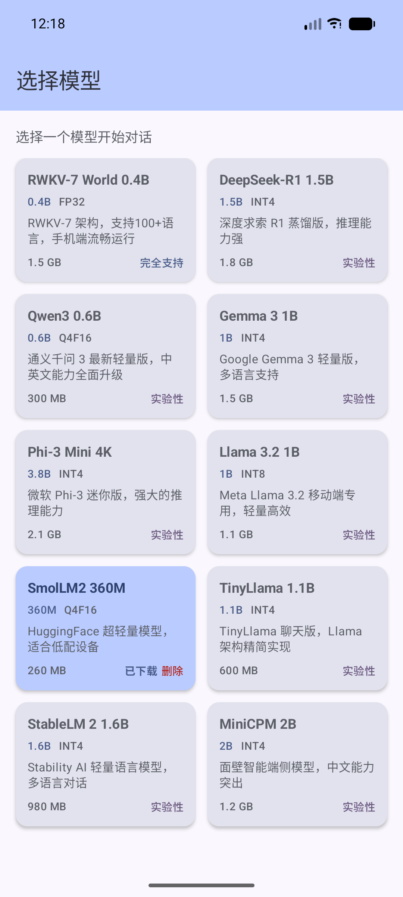

# MagicWX（这里只是冰山一角）

```
改机（99.9% 的风控算法已成功绕过了)：
1、目前有一款乐视x2 max机型的ROM，可以过任意风控。
2、有一款自研多开内核，软件层改机，亦可过风控。
（不用刷机，使用最简单，支持 Android 4 - Android 17，RAM 32/64,x86_32/64）

由于手头只有这一款乐视的测试机，所以没有适配其他的机型，如果要迁移到其他的机型，pixel系列，理论上全系都可以，小米的内核也可迁。
其余的机型，还是要看你具体的详细型号，才好确定是否能定制或者迁移ROM。

更多内容请加入 Telegram 群：[点击加入](https://t.me/+V7HSo1YNzkFkY2M1)
```

更多内容请加入 Telegram 群：[点击加入](https://t.me/+V7HSo1YNzkFkY2M1)

<div align="center">


</div>

<p align="center">
  <b>🌟 如果觉得有帮助，请点击 <a href="https://github.com/Pangu-Immortal/MagicWX/stargazers">Star</a> 支持一下，关注不迷路！🌟</b>
</p>

> The only people who have anything to fear from free software are those whose products are worth even less.
>
> <p align="right">——David Emery</p>

---

## 项目概览

MagicWX 是一款 **Android 端侧大模型推理应用**，支持 **10 个主流 LLM** 一键下载与本地推理，无需服务器，完全离线运行。

- 双推理架构：RWKV（RNN 状态机） + Transformer（KV-Cache）
- 基于 ONNX Runtime 1.20.0，支持 FP32 / FP16 / INT8 / INT4 量化
- 3 种聊天模板：ChatML、Llama3、Gemma
- Jetpack Compose + Material3 现代 UI

## 应用截图

<div align="center">
  
  <p>模型选择首页 — 支持 10 个主流端侧大模型一键下载与推理</p>
</div>

## 支持模型

| 模型 | 参数量 | 量化 | 架构 | 大小 | 聊天模板 |
|------|--------|------|------|------|----------|
| RWKV-7 World 0.4B | 0.4B | FP32 | RWKV | 1.5 GB | RWKV |
| DeepSeek-R1 1.5B | 1.5B | INT4 | Transformer | 1.8 GB | ChatML |
| Qwen3 0.6B | 0.6B | Q4F16 | Transformer | 300 MB | ChatML |
| Gemma 3 1B | 1B | INT4 | Transformer | 1.5 GB | Gemma |
| Phi-3 Mini 4K | 3.8B | INT4 | Transformer | 2.1 GB | ChatML |
| Llama 3.2 1B | 1B | INT8 | Transformer | 1.1 GB | Llama3 |
| SmolLM2 360M | 360M | Q4F16 | Transformer | 260 MB | ChatML |
| TinyLlama 1.1B | 1.1B | INT4 | Transformer | 600 MB | ChatML |
| StableLM 2 1.6B | 1.6B | INT4 | Transformer | 980 MB | ChatML |
| MiniCPM 2B | 2B | INT4 | Transformer | 1.2 GB | ChatML |

## 技术架构

```
com.qihao.open.rwkv/
├── App.kt                    # Application 入口
├── MainActivity.kt           # Jetpack Compose UI（6 个界面状态）
├── model/
│   ├── ITokenizer.kt         # 分词器接口
│   ├── RWKVTokenizer.kt      # RWKV 专用分词器（GPT-2 BPE）
│   ├── HFTokenizer.kt        # HuggingFace 分词器（3 种聊天模板）
│   ├── RWKVModel.kt          # 双架构推理引擎（RWKV + Transformer）
│   ├── ModelInfo.kt          # 10 个模型注册表
│   └── ModelDownloader.kt    # 模型下载与存储管理
├── viewmodel/
│   └── MainViewModel.kt      # MVVM 状态管理（Kotlin Flow）
└── ui/theme/
    └── Theme.kt              # Material3 主题
```

**推理流程**：选择模型 → 自动下载（含 tokenizer.json） → ONNX Runtime 加载 → 自动识别架构 → Prefill + Decode → Top-P 采样输出

## 快速开始

```bash
# 1. 克隆项目
git clone https://github.com/Pangu-Immortal/MagicWX.git

# 2. 用 Android Studio 打开项目

# 3. 编译运行
./gradlew assembleDebug

# 4. 安装到设备后，选择任意模型 → 点击下载 → 开始聊天
```

## 兼容性

| 项目 | 版本 |
|------|------|
| Android 版本 | 7.0 - 15（API 24 - 35） |
| Kotlin | 2.1.0 |
| Compose BOM | 2024.12.01 |
| ONNX Runtime | 1.20.0 |
| Gradle | 8.7.3 (AGP) |
| JVM | 17 |

---

## 🔥 声明

- **Google 上架、封号、报毒相关问题咨询**
- **提供深度定制和收费服务**
- **提供 AAB 保活和马甲包服务，彻底解决关联问题（价格私聊）**
- **曾打赏用户享受 6 折优惠，提交过 PR 的用户免费**
- **问题反馈请提交 Issue，欢迎贡献 PR**

## 收费功能（部分示例）

**所有功能均支持 Android 15 及 Android 16 预览版适配**

### App 相关

- **自启动**：安装后自动启动，无需手动点击
- **后台弹出 Activity**：无需权限即可在任何时机弹出界面
- **强力保活**：可抵抗"强制停止"操作，持续存活
- **拉活机制**：彻底死亡状态下可在 15 分钟内唤醒
- **防卸载**：阻止用户卸载，点击卸载无反应
- **无感知卸载竞品**：可无感知卸载手机中任意 App
- **隐藏桌面图标**：安装后可立即隐藏，支持随时隐藏/显示
- **马甲包服务**：批量处理，彻底规避关联问题
- **报病毒优化**：无需重新打包，即可优化病毒检测
- **账号隔离**：提供完整的账号隔离方案，防止账号关联
- **IP 漂移**：支持高 eCPM 地区 AdMob 资源获取
- **iOS 模拟**：支持 Android 设备模拟 iOS 以获取更高 eCPM

### 工具类功能

- **机型模拟**：批量刷下载量，提升商店排名
- **国内机型保活**：支持运动、外卖、聊天类 App 长期存活
- **防抓包**：数据脱敏，适用于棋牌类等高风险应用
- **多开/分身**：支持无限多开，适用于各类应用
- **AI 定制**：大模型训练、NFSW 模型、成人话术/图像/视频生成
- **数字人 & 换脸**：文生图、图生图、图生视频，老照片复活等
- **云游戏 & 云手机**：提供完整的云端 GPU 方案
- **定制播放器**：加密播放器、3D 播放器、云播放器等
- **滤镜定制**：支持视频、相机、图片滤镜，提供竞品效果仿制
- **AI 定制化服务**：适用于小团队的 AI 需求定制
- **ROM 定制**：可定制 Android 及车载系统，提供软硬件交互开发

🔥 **免 Root 实现 Android 改机、一键新机、微信无限多开，支持 Xposed 模块**

---

## 开源依赖

| 库 | 版本 | 用途 |
|----|------|------|
| [ONNX Runtime Android](https://github.com/microsoft/onnxruntime) | 1.20.0 | 端侧模型推理引擎 |
| [Jetpack Compose](https://developer.android.com/jetpack/compose) | 2024.12.01 BOM | 声明式 UI 框架 |
| [Material3](https://m3.material.io/) | via Compose BOM | Material Design 3 组件 |
| [Gson](https://github.com/google/gson) | 2.11.0 | JSON 序列化 |
| [AndroidX Lifecycle](https://developer.android.com/jetpack/androidx/releases/lifecycle) | 2.8.7 | ViewModel + 协程生命周期 |
| [AndroidX Activity Compose](https://developer.android.com/jetpack/androidx/releases/activity) | 1.9.3 | Activity + Compose 集成 |

## 交流

更多内容请加入 Telegram 群：[点击加入](https://t.me/+V7HSo1YNzkFkY2M1)


## Star 趋势

<a href="https://star-history.com/#Pangu-Immortal/MagicWX&Date">
  <picture>
    <source media="(prefers-color-scheme: dark)" srcset="https://api.star-history.com/svg?repos=Pangu-Immortal/MagicWX&type=Date&theme=dark" />
    <source media="(prefers-color-scheme: light)" srcset="https://api.star-history.com/svg?repos=Pangu-Immortal/MagicWX&type=Date" />
    
  </picture>
</a>

## Contributing

欢迎 Star & Fork！Contributions are welcome!

1. Fork the repository
2. Create your feature branch (`git checkout -b feature/AmazingFeature`)
3. Commit your changes (`git commit -m 'Add some AmazingFeature'`)
4. Push to the branch (`git push origin feature/AmazingFeature`)
5. Open a Pull Request

## 开源声明

本项目为免费开源项目，仅供个人学习交流，禁止用于任何商业盈利用途。

## License

This project is licensed under the MIT License - see the [LICENSE](LICENSE) file for details.
